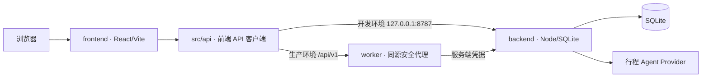

# 串 Knot

串 Knot 是一个以北京为首个演示城市的旅行规划应用。它把创作者路线、附近灵感、可拖拽时间轴、地图联动和实时行程放进同一条体验链路中。

当前仓库只保留最新版产品代码，并按前端、后端拆分。设计过程稿、重复原型、截图、构建产物、本地数据库和私密环境配置均不进入仓库。

## 当前功能

- 路线发现：浏览创作者分享的北京路线；
- 路线详情：查看地点顺序、地图和每站简介；
- 规划画布：在 00:00–24:00 时间轴上拖放地点，以 15 分钟为单位吸附；
- 行程 Agent 演示：展示“周六上午有事”时的局部调整过程；
- 附近灵感：图文卡片与百度地图点位联动；
- 行程结果：展示预算、地点、地图和旅程预览；
- 实时行程：按站执行、跳过、记录延误；
- 后端持久化：行程、版本、Agent Run 和执行事件写入 SQLite。

## 仓库结构

```text
.
├─ frontend/                 React + Vite 前端
│  ├─ src/                  页面、规划画布、地图和 API 客户端
│  ├─ public/assets/        当前界面使用的图片、Logo 和字体
│  ├─ worker/               生产环境同源 API 代理
│  └─ tests/                前端契约、Agent 与部署测试
├─ backend/                  Node.js + SQLite API
│  ├─ src/                  路由、存储、Agent、迁移和 Provider
│  ├─ test/                 后端端到端测试
│  └─ scripts/              数据库检查与备份
├─ .github/workflows/ci.yml GitHub Actions
└─ package.json             根目录统一命令
```

## 前后端关系



- 开发环境中，前端默认请求 `http://127.0.0.1:8787/api/v1`；
- 生产构建只请求同源 `/api/v1`，浏览器不会接触后端 service token；
- 同源 Worker 为匿名浏览器签发 HttpOnly 会话，并把可信用户标识转发给后端；
- 本地只预览前端、后端没有启动时，“确认行程”会明确生成本地演示行程；
- 后端正常运行时，行程会按 revision 持久化，不会使用本地演示结果冒充后端保存。

后端接口与安全边界见 [backend/README.md](backend/README.md)。

## 本地运行

要求：

- Node.js 24.x 或更高版本；
- npm 10.x 或更高版本。

首次安装前端依赖：

```bash
npm run setup
```

复制环境变量模板：

```powershell
Copy-Item .\frontend\.env.example .\frontend\.env.local
Copy-Item .\backend\.env.example .\backend\.env.local
```

如果需要真实百度底图，在 `frontend/.env.local` 中填写自己的浏览器端百度地图 AK。不要把真实密钥提交到 Git。

分别在两个终端启动：

```bash
npm run dev:backend
```

```bash
npm run dev:frontend
```

打开 `http://127.0.0.1:5173`。

## 测试与构建

运行全部前后端测试。前端测试会先生成一次生产构建，以验证部署产物：

```bash
npm test
```

构建前端：

```bash
npm run build
```

构建结果位于 `frontend/dist/`：

- `dist/client/`：静态前端；
- `dist/server/`：同源 API Worker。

## 一文件离线演示

比赛录屏或现场演示可以生成完全离线的一文件版本：

```bash
npm run build:demo
```

输出文件：

```text
release/Knot-Offline-Demo.html
```

这个 HTML 已内嵌当前使用的图片、Logo、字体、样式、JavaScript 和北京离线地图底图。把它复制到任意电脑后直接双击即可，不需要安装 Node.js、不需要启动后端，也不依赖地图或模型接口。离线地图固定展示城市道路、河道、公园、区域文字和行程点位，不提供缩放或实时导航，但地点标记仍可点击并联动详情。离线演示仍保留路线发现、详情、规划画布、Agent 动画、确认行程和实时行程等前端交互。

## 后端与第三方能力边界

当前后端是真实可运行、可持久化和可测试的 Node.js API，但以下第三方能力仍属于演示边界：

- 百度浏览器 JSAPI 可由用户自己的 AK 加载真实底图；后端 POI/路线 Provider 目前仍是本地估算；
- 小红书只处理用户主动提供的官方分享链接，并尽力读取公开 metadata；不会抓取正文全文或媒体；
- 美团模块只返回演示预订选项，不查询真实库存、价格或订单；
- 行程 Agent 支持外部模型 Provider，但 API Key 只允许放在后端环境变量中。

本项目不表示已经与小红书、百度或美团建立正式合作。

## GitHub 上传前检查

以下内容已被 `.gitignore` 排除：

- `.env.local` 与所有真实密钥；
- SQLite 数据库、备份和 WAL 文件；
- 日志、测试截图、构建目录和依赖目录；
- 本地运行时状态。

提交前建议执行：

```bash
npm test
npm run build
git status
```

## GitHub Pages

仓库包含 `.github/workflows/pages.yml`。推送到 `main` 后，GitHub Actions 会构建不含任何 AK 或服务端密钥的静态演示版，并发布到 GitHub Pages。

本地验证 Pages 产物：

```bash
npm --prefix frontend run build:pages
```

产物位于 `frontend/dist-static/`。公开演示保留完整前端流程、离线北京地图和可点击地点标记；需要后端持久化或真实第三方接口时，仍应在本地或独立服务端环境运行。
